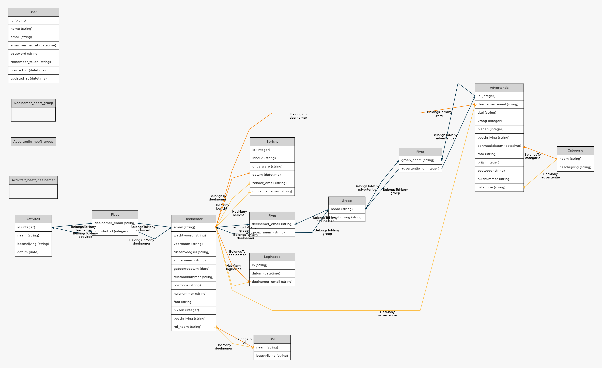

# Niks voor Niks – Local Trade Marketplace

Niks voor Niks is a **local trade marketplace** where members of a trade ring can offer and request products and services using their own virtual currency called **Niksen**.  

This application was originally built as a **school project for a real client**, using **Scrum / agile** practices, and is implemented as a full-featured **Laravel** web app.



---

## Table of Contents

- [About the Project](#about-the-project)
- [Features](#features)
- [Tech Stack](#tech-stack)
- [Getting Started](#getting-started)
  - [Prerequisites](#prerequisites)
  - [Installation](#installation)
  - [Running the Application](#running-the-application)
- [Usage](#usage)
  - [User Flow](#user-flow)
  - [Admin Flow](#admin-flow)
- [Project Structure](#project-structure)
- [Development Notes](#development-notes)
- [License](#license)

---

## About the Project

**Niks voor Niks** is a marketplace for a local trade ring.  
Members can:

- Offer their own products or services.
- Request items they need.
- Trade using a custom, internal currency called **Niksen** instead of money.

The project was developed as a **school assignment for a real-world client**, following **Scrum / agile** principles.  
It includes a complete **marketplace**, **user management**, and an **admin back office**.

---

## Features

### Marketplace

- Browse all **offers** and **requests**.
- Create, edit, and remove **listings**.
- Each listing contains details such as:
  - Title and description
  - Price in **Niksen**
  - Category and other relevant metadata

### Search & Filtering

- Search listings by **keyword**.
- Filter by:
  - Category
  - Listing type (offer / request)
  - Other criteria (depending on implementation).

### User Profiles

- Each seller/buyer has a **public profile page**:
  - Overview of their active listings.
  - Basic member information for the trade ring.

### Admin Panel

- Approve **new users** before they can participate.
- Manage **group activities** and community settings.
- View and **delete listings** at any time for moderation.
- General overview of the marketplace state (users, listings, etc.).

---

## Tech Stack

- **Framework:** Laravel (PHP)
- **Language:** PHP (backend), JavaScript (frontend)
- **Templating:** Blade
- **Styling:** Bootstrap (and custom CSS)
- **Database:** MySQL (or compatible SQL database)
- **Tooling:**
  - Composer
  - npm + Webpack Mix
  - PHPUnit (for testing)

You can see more details in `composer.json`, `package.json`, and `webpack.mix.js`.

---

## Getting Started

### Prerequisites

Make sure you have the following installed:

- **PHP** (version compatible with the Laravel version used in this project)
- **Composer**
- **Node.js** and **npm**
- **MySQL** (or another supported database)
- **Git** (optional but recommended)

### Installation

Clone the repository:

```bash
git clone https://github.com/ferrannl/Niks-voor-Niks.git
cd Niks-voor-Niks
