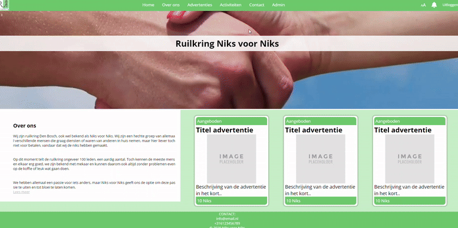

# Niks voor Niks – Local Trade Marketplace

**Niks voor Niks** is a local trade marketplace where members of a trade ring can offer and request products and services using their own virtual currency called **Niksen**.

This application was originally built as a **school project for a real client**, following **Scrum / agile** practices, and implemented as a full-featured **Laravel 7** web application.


---

## Table of Contents

- [About the Project](#about-the-project)
- [Features](#features)
- [Tech Stack](#tech-stack)
- [Getting Started](#getting-started)
  - [Prerequisites](#prerequisites)
  - [Installation](#installation)
  - [Configuration](#configuration)
  - [Database Setup](#database-setup)
  - [Frontend Assets](#frontend-assets)
  - [Running the Application](#running-the-application)
- [Usage](#usage)
  - [User Flow](#user-flow)
  - [Admin Flow](#admin-flow)
- [Project Structure](#project-structure)
- [Development Notes](#development-notes)
- [License](#license)

---

## About the Project

**Niks voor Niks** is a marketplace designed for a **local trade ring**.

Members can:
- Offer their own products or services  
- Request items they need  
- Trade using a custom, internal currency called **Niksen** instead of regular money  

The project was created as a **school assignment for a real-world client**, using **Scrum / agile** methodologies. It includes:
- A complete **marketplace** (offers + requests)  
- **User management** and profiles  
- An **admin back office** for moderating users and listings  

---

## Features

### Marketplace
- Browse all **offers** and **requests** created by members  
- Create, edit, and remove **listings**  
- Each listing includes:
  - Title  
  - Description  
  - Price in **Niksen**  
  - Category and relevant metadata  

### Search & Filtering
- Search listings by **keyword**  
- Filter by:
  - Category  
  - Listing type (offer / request)  
  - Other criteria (depending on implementation)  

### User Profiles
- Each member has a **public profile page**  
- Profile pages show:
  - Basic information about the member  
  - An overview of their active listings  

### Admin Panel
- Approve **new users** before they can participate  
- Manage **group activities** and community settings  
- View and **delete listings** for moderation  
- Get an overview of:
  - Total users  
  - Active listings  
  - Other marketplace statistics  

---

## Tech Stack

- **Framework:** Laravel 7 (PHP)  
- **Language:** PHP (backend), JavaScript (frontend)  
- **Templating:** Blade  
- **Styling:** Bootstrap 4 + custom CSS  
- **Database:** MySQL (or any Laravel-compatible SQL database)  
- **Build / Tooling:**
  - Composer  
  - Node.js + npm  
  - Laravel Mix (Webpack)  
  - PHPUnit (for testing)  

For more details, see:
- `composer.json`  
- `package.json`  
- `webpack.mix.js`  

---

## Getting Started

### Prerequisites
Make sure you have the following installed:
- **PHP** `^7.2.5` (compatible with Laravel 7)  
- **Composer**  
- **Node.js** and **npm**  
- **MySQL** (or another supported database)  
- **Git** (recommended)  

---

### Installation

Clone the repository and install dependencies:

```bash
git clone https://github.com/ferrannl/Niks-voor-Niks.git
cd Niks-voor-Niks

# Install PHP dependencies
composer install

# Install frontend dependencies
npm install
```

---

### Configuration

1. Copy the example environment file and generate an app key:
   ```bash
   cp .env.example .env
   php artisan key:generate
   ```

2. Update `.env` with your local settings:
   ```env
   APP_NAME="Niks voor Niks"
   APP_ENV=local
   APP_KEY=base64:...
   APP_DEBUG=true
   APP_URL=http://localhost

   DB_CONNECTION=mysql
   DB_HOST=127.0.0.1
   DB_PORT=3306
   DB_DATABASE=niks_voor_niks
   DB_USERNAME=your_db_user
   DB_PASSWORD=your_db_password
   ```

---

### Database Setup

Create the database in MySQL (matching `DB_DATABASE` in your `.env`):

```sql
CREATE DATABASE niks_voor_niks CHARACTER SET utf8mb4 COLLATE utf8mb4_unicode_ci;
```

Run Laravel migrations:

```bash
php artisan migrate
```

Optionally run seeders if configured:

```bash
php artisan db:seed
```

---

### Frontend Assets

Compile the frontend assets using Laravel Mix:

For development:
```bash
npm run dev
```

For production:
```bash
npm run prod
```

---

### Running the Application

Start the Laravel development server:

```bash
php artisan serve
```

By default, the app will be available at:

```
http://localhost:8000
```

---

## Usage

### User Flow
1. Register as a new member of the trade ring  
2. Wait for admin approval (if required)  
3. Once approved:
   - Browse existing offers and requests  
   - Create your own listings (offers or requests)  
   - Edit or remove your listings  
   - View your profile page with an overview of your activity  

### Admin Flow
Admins can:
- Review and approve new user registrations  
- Manage group activities and high-level settings  
- View all listings (offers + requests)  
- Delete or moderate listings at any time  
- Monitor marketplace health (users, listings, etc.)  

---

## Project Structure

This is a standard Laravel 7 project layout. Key directories:

- `app/` — Application logic, models, controllers, etc.  
- `routes/` — HTTP routes (`web.php`, `api.php`)  
- `resources/views/` — Blade templates for frontend views  
- `resources/js/` — JavaScript (potentially Vue components)  
- `resources/sass/` or `resources/css/` — Stylesheets (compiled by Laravel Mix)  
- `database/migrations/` — Database schema migrations  
- `database/seeds/` — Optional database seeders  
- `public/` — Publicly accessible web root (entry point, assets)  
- `webpack.mix.js` — Laravel Mix configuration for asset compilation  

---

## Development Notes

The project was done as a school project using **Scrum**:
- Iterative development  
- Regular feedback from a real client  

The codebase is structured to be easy to extend:
- Add new listing types, categories, or filters  
- Refine the admin panel and dashboards  

Testing:
- PHPUnit is configured via `phpunit.xml`  
- Create tests under `tests/` and run:
  ```bash
  php artisan test
  # or
  ./vendor/bin/phpunit
  ```

---

## License

This project is based on the Laravel framework (MIT licensed).  
No explicit license file is included for this repository at the moment.  

If you plan to use this project beyond personal or educational purposes, please contact the repository owner (**@ferrannl**) to clarify licensing and permissions.

---
```
